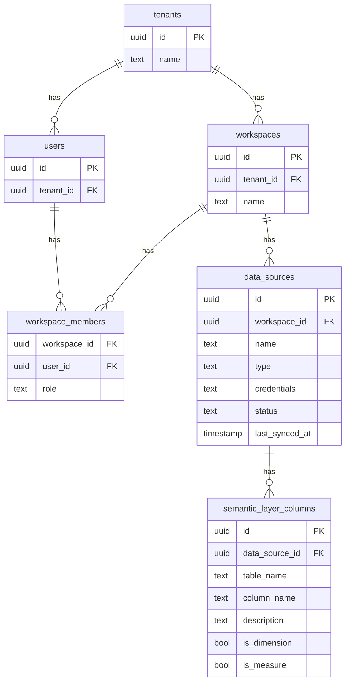

# Architecture Overview

**Project**: BI Reset
**Version**: 1.0
**Date**: December 12, 2025

## 1. Introduction

This document provides a comprehensive overview of the system architecture for the BI Reset platform. It is designed to serve as a technical blueprint for AI development agents and a clear reference for human stakeholders to understand the system's structure, components, and data flows.

BI Reset employs a **hybrid, multi-layered architecture** that strategically combines custom-built components with best-in-class open-source and managed services. This approach accelerates development by leveraging mature, proven tools for commodity features (such as visualization) while focusing custom development efforts on the platform's unique value proposition: AI-powered, multi-source analytics.

## 2. Architectural Principles

- **Decoupled Layers**: The presentation, application, and data layers are designed to be independent, allowing for separate scaling and development.
- **API-First**: All components communicate via well-defined APIs, enabling extensibility and integration.
- **Security by Design**: Multi-tenancy and data isolation are enforced at the database level using Supabase's Row-Level Security (RLS).
- **Leverage Managed Services**: Offload infrastructure management to specialists (Supabase for backend, Snowflake for data warehousing, Vercel for hosting) to focus on application development.

## 3. Architectural Layers

The system is divided into three primary layers:

1.  **Presentation Layer**: The user-facing components, including the web UI and the embedded Metabase interface.
2.  **Application & AI Layer**: The core logic of the platform, including the backend services, the LLM orchestration layer, and user management.
3.  **Data Integration & Storage Layer**: The pipeline for ingesting, transforming, and storing data from multiple sources.

### C4 Model: System Context Diagram

```
+------------------+     +------------------+     +------------------+
|      User        | --> |   BI Reset UI    | --> |   BI Reset API   |
+------------------+     | (Refine/React)   |     | (Supabase/Vercel)| 
                         +------------------+     +------------------+
                                                       |
                                                       v
+------------------+     +------------------+     +------------------+
|   Zoho API       | <-- |   ELT Pipeline   | --> |  Data Warehouse  |
+------------------+     |    (Airbyte)     |     |   (Snowflake)    |
                         +------------------+     +------------------+
+------------------+     ^                      |
|   SAP B1 API     | ----+                      v
+------------------+                      +------------------+
                                          |  Metabase        |
                                          | (BI Engine)      |
                                          +------------------+
```

## 4. Component Breakdown

### 4.1. Presentation Layer

-   **BI Reset UI (Refine/React)**: The main web application built using the Refine framework on React. It provides the primary user interface for navigation, administration, and interacting with the AI query engine. Hosted on Vercel.
-   **Metronic Admin Template**: Provides the visual design system and pre-built UI components for the admin and dashboard sections of the UI.
-   **Metabase Frontend (Embedded)**: The Metabase user interface is embedded within the BI Reset UI to provide the report and dashboard building experience. This leverages Metabase's mature query builder and visualization capabilities.

### 4.2. Application & AI Layer

-   **BI Reset API (Supabase & Vercel Edge Functions)**: A combination of Supabase's PostgREST API for database operations and custom Vercel Edge Functions for business logic. This layer handles requests from the UI, manages user sessions, and interacts with the AI and data layers.
-   **Supabase Backend**: Provides the core backend services:
    -   **PostgreSQL Database**: Stores user metadata, tenant information, workspace settings, and semantic layer definitions.
    -   **Supabase Auth**: Manages user authentication and JWT-based session management.
    -   **Supabase Storage**: Used for temporary storage of user-uploaded files (e.g., CSVs) before they are processed.
-   **LLM Orchestration Layer (LangChain)**: A custom service, likely running on Vercel Serverless Functions, that manages interactions with LLMs. It takes natural language input from the user, combines it with metadata from the semantic layer, and constructs a precise prompt to generate a SQL query.

### 4.3. Data Integration & Storage Layer

-   **ELT Pipeline (Airbyte)**: An instance of Airbyte (either open-source self-hosted or cloud-managed) is responsible for extracting data from source systems.
    -   **Connectors**: Airbyte connectors for Zoho, SAP Business One, and other required sources are configured to pull data on a schedule.
-   **Data Warehouse (Snowflake)**: A cloud data warehouse that serves as the single source of truth for all analytical data. Data from all sources is loaded into Snowflake, where it is transformed and modeled for analysis.
-   **dbt (Data Build Tool)** (Optional but Recommended): Used within the data warehouse to manage the "T" (Transform) in ELT. dbt models will be used to clean, join, and aggregate raw data into analysis-ready tables.

## 5. Data Flow

1.  **Data Ingestion (ELT)**:
    -   Airbyte connects to source APIs (Zoho, SAP) on a schedule.
    -   It extracts raw data and loads it into a `raw_data` schema in Snowflake.
    -   dbt models are run in Snowflake to transform the raw data into cleaned, structured tables in a `analytics` schema. This is where cross-source joins occur.

2.  **AI-Powered Query**:
    -   A user types a question (e.g., "show me sales by region") into the BI Reset UI.
    -   The UI sends the request to the BI Reset API.
    -   The API forwards the request to the LLM Orchestration Layer.
    -   The LLM layer fetches relevant metadata from the semantic layer stored in Supabase (e.g., table names, column descriptions, join relationships).
    -   It constructs a detailed prompt and sends it to an LLM (e.g., GPT-4) to generate a SQL query.
    -   The generated SQL is returned to the backend, which then executes it directly against Snowflake via the Metabase API or a direct connection.
    -   The results are returned to the UI and displayed as a chart or table.

3.  **Manual Report Building**:
    -   A user opens the embedded Metabase interface.
    -   Metabase is connected to the Snowflake `analytics` schema.
    -   The user uses the Metabase query builder to create a report by selecting tables and fields.
    -   Metabase generates and executes a SQL query against Snowflake.
    -   The results are rendered as a visualization within the embedded Metabase UI.

## 6. Supabase Database Schema

This section details the primary tables managed in the Supabase PostgreSQL database. This schema is designed for multi-tenancy, with all core tables linked to a `tenant_id`.

### Entity-Relationship Diagram (ERD)



### Table Definitions

#### `tenants`
Stores information about each customer tenant.

| Column | Type | Description |
| :--- | :--- | :--- |
| `id` | `uuid` | **Primary Key.** Unique identifier for the tenant. |
| `name` | `text` | The display name of the tenant organization. |
| `created_at` | `timestamp` | Timestamp of when the tenant was created. |

#### `users`
This table is an extension of `auth.users` from Supabase Auth, linking users to a tenant.

| Column | Type | Description |
| :--- | :--- | :--- |
| `id` | `uuid` | **Primary Key.** Foreign key to `auth.users.id`. |
| `tenant_id` | `uuid` | **Foreign Key** to `tenants.id`. Associates the user with a tenant. |

#### `workspaces`
A tenant can have multiple workspaces to isolate projects or departments.

| Column | Type | Description |
| :--- | :--- | :--- |
| `id` | `uuid` | **Primary Key.** |
| `tenant_id` | `uuid` | **Foreign Key** to `tenants.id`. |
| `name` | `text` | The name of the workspace (e.g., "Marketing Analytics"). |

#### `workspace_members`
A join table to manage user roles within workspaces.

| Column | Type | Description |
| :--- | :--- | :--- |
| `workspace_id` | `uuid` | **Composite Primary Key & Foreign Key** to `workspaces.id`. |
| `user_id` | `uuid` | **Composite Primary Key & Foreign Key** to `users.id`. |
| `role` | `text` | The user's role in the workspace (`admin`, `editor`, `viewer`). |

#### `data_sources`
Stores connection information for each data source configured in a workspace.

| Column | Type | Description |
| :--- | :--- | :--- |
| `id` | `uuid` | **Primary Key.** |
| `workspace_id` | `uuid` | **Foreign Key** to `workspaces.id`. |
| `name` | `text` | User-defined name for the data source. |
| `type` | `text` | The type of the data source (e.g., `zoho_crm`, `sap_b1`). |
| `credentials` | `text` | **Encrypted** connection credentials. |
| `status` | `text` | The current status of the data source (`pending`, `connected`, `error`). |
| `last_synced_at` | `timestamp` | Timestamp of the last successful data sync. |

#### `semantic_layer_columns`
Stores the business-friendly metadata for columns that the LLM will use to generate queries.

| Column | Type | Description |
| :--- | :--- | :--- |
| `id` | `uuid` | **Primary Key.** |
| `data_source_id` | `uuid` | **Foreign Key** to `data_sources.id`. |
| `table_name` | `text` | The name of the table in the data warehouse. |
| `column_name` | `text` | The name of the column in the data warehouse. |
| `description` | `text` | A human-readable description of the column's business meaning. |
| `is_dimension` | `bool` | True if the column can be used for grouping. |
| `is_measure` | `bool` | True if the column can be used for aggregation. |


## 7. Multi-Tenancy & Security

-   **Tenant Isolation**: Each customer is a "tenant." All data in the Supabase PostgreSQL database is associated with a `tenant_id`.
-   **Row-Level Security (RLS)**: Supabase RLS policies are applied to every query to ensure that users can only access data belonging to their own tenant.
-   **Workspace Separation**: Within a tenant, users can be assigned to specific "workspaces," with access to only the data sources and reports within that workspace.
-   **Credential Management**: All data source credentials and API keys are encrypted at rest in the Supabase database.
-   **Secure Embedding**: The Metabase frontend is embedded using a secure JWT-based authentication flow to ensure that users can only access Metabase sessions they are authorized for.
